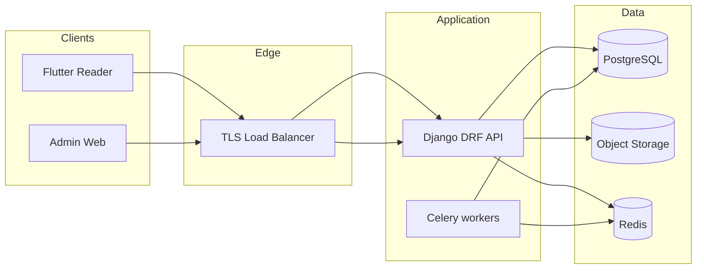
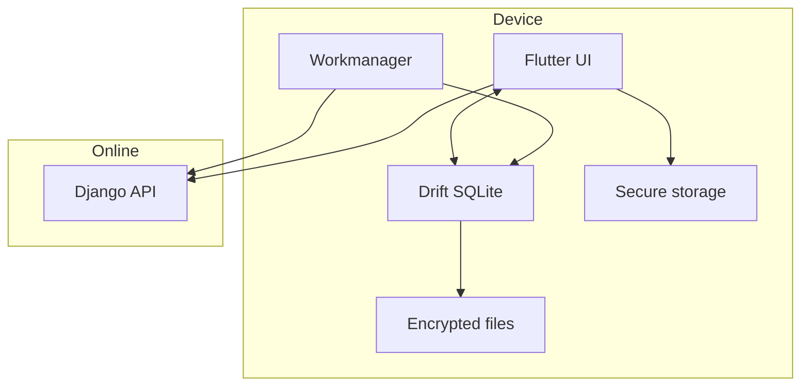

# Ethiopian Religious Books — Implementation Plan

**Document version:** 1.3  
**Prerequisites:** [Functional requirements & data model](README.md) · [UI/UX requirements](README-UI-UX.md) · [Local setup & dev ergonomics](SETUP.md)  

This document is the **engineering implementation plan**: **technical decisions**, **screen/page map**, **API contracts**, **offline-first sync**, **feature-to-layer mapping**, and **delivery phases**.  

**Stack:** **Flutter** reader (Android-first; iOS build optional until release) · **Django** API (REST) · PostgreSQL · Redis · S3 (MinIO locally) · separate admin web.  

**Local:** Backend dependencies and API run via **Docker Compose** ([§12.1](#121-local-development-with-docker-required-workflow)); Flutter + Vite run on the **host**.

---

## 1. How to use this document

| Section | Owner |
|---------|--------|
| §2 Technical decisions | Tech lead (ADRs) |
| §3 System architecture | All engineers |
| §4 Repository layout | Tech lead |
| §5 Delivery phases | PM + tech lead |
| §6 Reader app — pages | Mobile |
| §7 Admin web — pages | Frontend |
| §8 API catalog | Backend — **drf-spectacular** is source of truth for OpenAPI |
| §9 Features ↔ implementation | QA + leads |
| §10–12 Security, testing, ops | Platform + QA |

---

## 2. Technical decisions (locked for MVP unless noted)

Decisions are **Architecture Decision Record (ADR)** style: context → decision → consequences.

### ADR-001 — Primary mobile platform

| | |
|--|--|
| **Context** | MVP assumes **Android-first** for `FLAG_SECURE` strength ([README §1.2](README.md)). |
| **Decision** | Ship **Android** first using **Flutter**. **iOS** binary may be built from the same codebase but **store release** remains optional until screenshot posture is accepted. |
| **Consequences** | Implement **Android-specific** secure surface via **platform channel** or small **MethodChannel** plugin; test only Android in MVP QA gates unless iOS is in scope. |

### ADR-002 — Mobile framework (Flutter)

| | |
|--|--|
| **Context** | Need **offline-first** catalog + downloads, **encrypted** local data, Ethiopic typography, **`FLAG_SECURE`** on Android reader surfaces. |
| **Decision** | **Flutter 3.22+** (Dart 3) + **Material 3** (`useMaterial3: true`). |
| **State / DI** | **Riverpod** (recommended) or **Bloc** — pick one for the whole app. |
| **Local database** | **Drift** (SQLite) for **catalog cache**, **sync cursors**, **outbox**, and **download job** metadata; **SQLCipher** via Drift FFI or encrypted filesystem if threat model requires DB encryption at rest. |
| **Networking** | **dio** with interceptors (refresh token, retry with jitter). |
| **Connectivity** | **connectivity_plus** + **internet_connection_checker** (or reachability ping) to distinguish “wifi connected” vs “real internet”. |
| **Background work** | **workmanager** (Android) to **resume sync** and **retry downloads** when network returns; iOS background tasks deferred. |
| **Secure storage** | **flutter_secure_storage** for refresh token + CEK material (Android Keystore / iOS Keychain). |
| **FLAG_SECURE** | Small **platform channel** or community plugin audited for your min SDK; apply to **reader route** and any screen showing book plaintext. |
| **HTML body** | **flutter_inappwebview** or official **webview_flutter** with **JavaScript off**, file access locked, `user-select: none` — align with [ADR-008](#adr-008--in-book-content-format-mvp). |
| **Rejected for MVP** | **GetX** as primary architecture (harder to test); **unencrypted** plain `shared_preferences` for tokens. |

### ADR-003 — Backend language and framework (Django)

| | |
|--|--|
| **Context** | REST API, JWT, PostgreSQL, S3 presigned URLs, async email, admin audit, future Django Admin optional. |
| **Decision** | **Python 3.12+** + **Django 5.x** + **Django REST Framework (DRF)** + **djangorestframework-simplejwt** (access + refresh rotation policy as code). |
| **Async tasks** | **Celery** + **Redis** (or **Django Q** if you want lighter ops) for **password-reset email**, future notifications, heavy ingest hooks. |
| **ORM / migrations** | Django built-in migrations (no Alembic). |
| **S3** | **django-storages** + **boto3** for presigned URLs; buckets remain private. |
| **API docs** | **drf-spectacular** → **OpenAPI 3** (`/api/schema/` and Swagger UI in dev only). |
| **Config** | **django-environ** for 12-factor settings. |
| **Alternative** | **Django Ninja** instead of DRF — faster typing, smaller ecosystem; team must agree on one. |
| **Password hashing** | Prefer **Argon2** via `argon2-cffi` and `PASSWORD_HASHERS = ["django.contrib.auth.hashers.Argon2PasswordHasher", …]` (per Django docs). |
| **Consequences** | Admin web continues to call the **same** JSON API; optional later: **Django Admin** for superuser ops only (not publisher UX replacement). |

### ADR-004 — Database

| | |
|--|--|
| **Decision** | **PostgreSQL 15+** (managed: RDS, Cloud SQL, or Neon). |
| **Extensions** | `citext` for email; `pgcrypto` or app-level hashing only (prefer app Argon2). |

### ADR-005 — Object storage

| | |
|--|--|
| **Decision** | **S3-compatible** storage (AWS S3, GCS with interoperability, **MinIO** locally). |
| **Policy** | Buckets **private**; readers receive **time-limited presigned GET**; admins use presigned **PUT** multipart for large packages. |

### ADR-006 — Authentication

| | |
|--|--|
| **Decision** | **Email + password**; **Argon2id** password hashing; **JWT access** (15 min) + **opaque refresh** (14–30 days) stored hashed in `sessions`. |
| **Rotation** | Refresh token **rotation** on each refresh; detect reuse → revoke family (optional MVP: single refresh per device). |

### ADR-007 — Content encryption model

| | |
|--|--|
| **Context** | [README §7.3](README.md) **REQ-ENC-001**. |
| **Decision** | Per **`book_revision`**, server generates **CEK** (256-bit AES). CEK stored **wrapped** (KMS or master key in env for MVP — migrate to KMS before prod scale). |
| **Reader** | `GET .../download` returns **CEK** only to authenticated reader over TLS; Flutter stores CEK via **flutter_secure_storage** (backed by **Keystore** on Android). |
| **Manifest** | May be **plaintext JSON** in object storage; **blobs encrypted** with CEK (AES-GCM per file or single stream). |

### ADR-008 — In-book content format (MVP)

| | |
|--|--|
| **Context** | [README §12 open decisions](README.md). |
| **Decision (recommended)** | **`html_chunks`**: manifest lists chapters; each chapter = one **HTML snippet** (subset: `p`, `h1–h3`, `img`, `br`, `strong`, `em`) sanitized with **allowlist** on ingest (**nh3** / **bleach** in Django pipeline). Client: **Flutter WebView** with **JavaScript disabled**, **no file URL access**, CSS `user-select: none`. |
| **Alternative** | **Custom JSON** rendered with Flutter **SelectableText** disabled and custom spans — best DRM UX, higher build cost. |
| **Consequences** | Test **TalkBack** / **VoiceOver** with WebView chrome per **REQ-UX-A11Y-001**. |

### ADR-009 — Admin application

| | |
|--|--|
| **Decision** | **Separate web app** (not inside reader). **React** + **Vite** + **TypeScript** + **TanStack Query** + **React Router** + **MUI** or **shadcn/ui**. |
| **Auth** | Same backend JWT; role `admin` required for `/v1/admin/*`. |

### ADR-010 — API documentation

| | |
|--|--|
| **Decision** | **drf-spectacular** generates **OpenAPI 3**; expose Swagger/Redoc **only in non-prod** or behind auth. |

### ADR-011 — Observability

| | |
|--|--|
| **Decision** | **Structured JSON logs** (Django logging JSON formatter); **Sentry** SDK for **Django** and **Flutter**; OpenTelemetry optional later. |

### ADR-012 — Local development with Docker (mandatory)

| | |
|--|--|
| **Context** | Everyone on the team needs the **same** Postgres, Redis, MinIO, Mailhog, Django API, and Celery **without** hand-installing services. |
| **Decision** | **Docker Compose** is the **only supported** way to run the **local backend stack**. Developers run **Flutter** and **admin-web (Vite)** on the **host** (or Flutter in IDE), pointing at containerized APIs. |
| **Scope** | **In Docker:** `postgres`, `redis`, `minio`, `mailhog`, `api` (Django/Gunicorn or `runserver` in dev), `celery_worker` (same image as `api`, different command). **On host:** `reader_flutter`, `admin-web` dev server. |
| **Consequences** | Check in **`infra/docker-compose.yml`** + **`.env.example`**; document ports and emulator networking in **§12.1**. CI can reuse the same compose file for integration tests. |

### ADR-013 — Offline-first reader + sync

| | |
|--|--|
| **Context** | Users read **without continuous internet**; catalog and downloads must remain usable; when online, app should **reconcile** server changes (new books, unpublish, revision bumps) **without** blocking the UI. |
| **Decision** | **Local-first UI**: **Drift** is the **source of truth for what the Library shows** (merged with sync state). Network updates **Drift** in the background. |
| **Catalog sync** | **ETag**-based: `GET /v1/books` returns `ETag: "catalog-<hash>"` computed from `max(updated_at)` of published books + a **global catalog version** counter (see §8.4.1). Client sends `If-None-Match` → **304 Not Modified** skips JSON parse. On change, **replace** cached rows in a transaction. |
| **Detail sync** | On demand when online; cache row per `book_id` with `fetched_at`. |
| **Mutations outbox** | `legal_acceptances`, `PATCH /me`, `logout` revocation: append to **`outbox_actions`** table; **SyncCoordinator** flushes when online with exponential backoff; idempotency keys on server where needed. |
| **Downloads** | **Resume-capable** jobs stored in Drift (`download_jobs`: book_id, revision_id, state, bytes_received); **workmanager** retries when **Wi‑Fi** policy allows and network is up. |
| **Unpublish / revision** | After catalog sync, if server says book **hidden** or `published_revision_id` changed, UI marks local row **stale**; **Reader** blocks open until user **updates** or **deletes** (per **REQ-R-060**). |
| **Conflict policy** | **Server wins** for metadata; **client wins** for reading position/bookmarks until server sync of those is added post-MVP. |
| **Consequences** | Implement **global `SyncStatus` stream** (Riverpod) for banner: “Offline · showing saved library” / “Syncing…” / “Couldn’t sync — tap to retry”. |

---

## 3. System architecture



### 3.1 Flutter offline-first data flow



**Flows**

- **Catalog (online):** `SyncCoordinator` calls **`GET /v1/sync/catalog`** or **`GET /v1/books`** with **`If-None-Match`** → on **200**, upsert **Drift** `cached_books`; on **304**, skip body.  
- **Catalog (offline):** Library reads **only Drift**; show **Offline** banner; **Search** runs on **local** cached metadata (same table).  
- **Download:** When online, **dio** fetches presigned objects to **encrypted filesystem**; job state in **Drift**; **workmanager** retries pending jobs after connectivity restore.  
- **Mutations:** Legal accept / profile patch enqueue **outbox**; flush when online.  
- **Server:** Django reads/writes PostgreSQL; never stores book plaintext in DB; Celery sends email; presigned S3 same as before.  
- **Admin upload:** Browser PUTs to presigned URLs; Django finalizes revision in transaction.

---

## 4. Repository layout (monorepo recommended)

```
ethiopian-religious-books/
├── apps/
│   ├── reader_flutter/          # Flutter app (Android primary)
│   │   ├── lib/
│   │   │   ├── main.dart
│   │   │   ├── app.dart
│   │   │   ├── features/
│   │   │   ├── core/            # dio, sync, drift, secure_storage
│   │   │   └── platform/        # FLAG_SECURE channel
│   │   └── test/
│   └── admin-web/               # Vite React
├── packages/
│   └── api_contract/            # optional: openapi_generator → dart + ts
├── services/
│   └── django_api/              # Django project root (manage.py)
│       ├── config/              # settings: base, dev, prod
│       ├── apps/
│       │   ├── accounts/        # users, JWT views
│       │   ├── catalog/         # books, revisions, sync ETag
│       │   ├── legal/
│       │   ├── admin_api/
│       │   └── common/          # audit, storage helpers
│       ├── requirements/
│       └── tests/
├── infra/
│   ├── docker-compose.yml       # postgres + redis + minio + mailhog + api + celery
│   ├── docker-compose.override.yml   # optional: bind mounts, runserver (see §12.1)
│   ├── .env.example             # copy to .env (not committed)
│   └── terraform/               # optional
├── docs/
├── README.md
├── README-UI-UX.md
└── README-IMPLEMENTATION.md     # this file
```

---

## 5. Delivery phases (implementation order)

### Phase 0 — Foundation (Week 1)

- `docker-compose`: **Postgres + Redis + MinIO + Mailhog** + **Django** + **Celery worker**.  
- Django: project skeleton, **DRF**, **simplejwt**, **drf-spectacular**, **django-environ**, **django-cors-headers**, health route `GET /healthz/`.  
- Initial Django migrations: `users`, `sessions` (if not only JWT blacklist), `legal_documents`, `legal_acceptances`.  
- Flutter: app shell, **go_router** (or **Navigator 2.0**), Material 3 theme, **Drift** empty DB + **SyncCoordinator** stub, **platform channel** stub for **FLAG_SECURE**.  

### Phase 1 — Identity, legal, outbox (Week 2)

- Django: implement **§8.1** auth + **§8.2** legal; Celery task for **forgot-password** email.  
- Flutter: Register / Login / Logout; **flutter_secure_storage** for refresh token; **dio** + refresh interceptor.  
- Flutter: Legal screens; on Accept → **insert outbox row** + optimistic local flag; **flush** when online.  
- Flutter: **connectivity** listener → trigger `SyncCoordinator.syncNow()`.  

### Phase 2 — Catalog cache & offline library (Week 3)

- Django: `books`, `book_revisions`, … models per [README §10](README.md); **`CatalogSyncMixin`** computing **ETag**; implement **`GET /v1/sync/catalog`** (§8.4.1) and ETag on **`GET /v1/books`**.  
- Flutter: **Drift** tables `CachedBook`, `SyncMeta`; Library reads **from Drift** always; online sync updates Drift.  
- Flutter: Book detail: show cached data immediately; **background refresh** when online.  
- Flutter: **local metadata search** (`LIKE` on title/author/tags in Drift) when offline; when online, optional server search can still run.  

### Phase 3 — Download, encrypted files, reader (Week 4–5)

- Django: **GET /v1/books/{id}/download** unchanged contract.  
- Flutter: **download service** (dio + file sink), checksum verify, CEK to secure storage; **workmanager** for retry.  
- Flutter: **Reader** WebView, TOC sheet, progress + bookmarks in Drift; **FLAG_SECURE** on reader route (Android).  
- Flutter: Wi‑Fi-only + storage checks; pending downloads resume after reconnect.  

### Phase 4 — Admin web + publish pipeline (Week 5–6)

- Django: admin API views, permissions (`IsAdminUser`), presigned upload flow, audit signals or explicit service calls.  
- Admin web: unchanged routes; point `VITE_API_BASE` to Django.  
- Optional: **Django Admin** read-only for superuser debugging (not publisher UX).  

### Phase 5 — Hardening & release (Week 7)

- Flutter: **integration tests** with **mock web server**; airplane-mode manual test script.  
- Django: **pytest-django** coverage for sync ETags, unpublish behavior, JWT rotation.  
- Play internal track; document screenshot limits; **Android backup** rules for Flutter secure storage paths.  

---

## 6. Reader app (Flutter, Android-first) — pages / routes

Each row: **Route / screen** · **Purpose** · **State** · **API / sync** · **Local (Drift / files)** · **Notes**

| Screen | Purpose | Primary state | API / sync | Local |
|--------|---------|---------------|------------|--------|
| **Splash** | Restore session | `SessionState` | If online: `POST /v1/auth/refresh` | `flutter_secure_storage` + `SyncMeta` |
| **LanguageSelect** | First-run UI language | `Locale` | — | `settings` row in Drift |
| **LegalAcceptance** | Terms + Privacy | `pendingDocs[]` | `GET /v1/legal/documents` (optional) | **Outbox** row until `POST /legal/acceptances` succeeds |
| **Register** | Create reader account | form | `POST /v1/auth/register` | then persist tokens |
| **Login** | Obtain tokens | form | `POST /v1/auth/login` | refresh → secure storage |
| **ForgotPassword** | Request email | email | `POST /v1/auth/forgot-password` | — |
| **ResetPassword** | Set new password | token + password | `POST /v1/auth/reset-password` | clear local session |
| **MainShell** | Bottom nav host | selected tab | `SyncCoordinator` on resume | Drift |
| **LibraryHome** | Catalog + continue | `AsyncValue` from Drift watch | Online: **§8.4.1** + background `GET /books` if ETag stale | **`CachedBook`** rows; merge download state |
| **BookDetail** | Metadata + download | `CachedBook` + server refresh | Online: `GET /v1/books/{id}` | Upsert Drift; show stale badge if offline |
| **DownloadProgress** | (sheet or inline) | job state | presigned GET via dio | **files** + `download_jobs` in Drift |
| **Reader** | Read book | `position`, `theme`, `fontStep` | cover URL only if cached | **WebView** + progress/bookmarks tables |
| **TocSheet** | Navigate chapters | manifest | — | from local manifest JSON |
| **BookmarksSheet** | List bookmarks | `Bookmark[]` | — | Drift |
| **ReaderSettingsSheet** | Font / theme | prefs | — | Drift `settings` |
| **Search** | Metadata search | query, results | Online: `GET /v1/books?query=`; Offline: **Drift** `LIKE` | recent queries optional in Drift |
| **Account** | Hub | user profile | `GET /v1/me` when online | cache profile row |
| **ProfileEdit** | Display name, language | form | `PATCH /v1/me` or **outbox** if offline | Drift + outbox |
| **StorageSettings** | Usage + delete local | computed | — | scan book dir + Drift |
| **DownloadSettings** | Wi‑Fi only toggle | bool | — | Drift |
| **LegalList** | Open terms/privacy | links | — | — |
| **Faq** | Static | local asset / remote | optional future API | cache |
| **Support** | Mailto / form URL | — | — | — |

**Recommended additions to API for clean mobile UX**

- `GET /v1/me` — current user profile.  
- `PATCH /v1/me` — `display_name`, `preferred_ui_language`.  
- `GET /v1/legal/documents` — listed in **§8.2** (supports offline-cached links).  
- `GET /v1/sync/catalog` — **§8.4.1** (ETag-friendly).  

### 6.1 Drift tables (reference)

| Table | Purpose |
|-------|---------|
| `cached_books` | Mirror of catalog rows + `local_download_state`, `last_synced_at` |
| `sync_meta` | `catalog_etag`, `last_successful_sync_at`, `last_error` |
| `outbox_actions` | `id`, `type` (`legal_accept`, `patch_me`, …), `payload_json`, `status`, `attempts`, `next_attempt_at` |
| `download_jobs` | Per-book/revision download state for resume |
| `reading_progress` | FK to book/revision, anchor |
| `bookmarks` | Local bookmarks |
| `settings` | Key-value (theme, font step, Wi‑Fi only, locale) |
| `profile_cache` | Last known `GET /me` for offline Account screen |

---

## 7. Admin web — pages / routes

| Route | Purpose | API |
|-------|---------|-----|
| `/login` | Admin JWT | `POST /v1/auth/login` |
| `/books` | Table: title, visibility, revision, updated | `GET /v1/admin/books` |
| `/books/new` | Create metadata | `POST /v1/admin/books` |
| `/books/:id` | Edit metadata, tags, cover | `PATCH /v1/admin/books/{id}`, tag endpoints optional |
| `/books/:id/revisions/new` | Upload wizard | `POST .../revisions`, presigned PUTs, `.../complete` |
| `/books/:id/publish` | Publish modal | `POST .../publish` |
| `/audit` | Audit log | `GET /v1/admin/audit_logs` |

---

## 8. API catalog (v1)

**Global conventions**

- **Base URL:** `https://api.example.com/v1`  
- **Auth:** `Authorization: Bearer <access_token>` except where noted.  
- **Errors:** JSON `{ "error": { "code": "STRING", "message": "human", "details": {} } }`  
- **IDs:** `uuid` strings  
- **Timestamps:** ISO-8601 UTC  

### 8.1 Auth — public

#### `POST /v1/auth/register`

**Body**

```json
{
  "email": "user@example.com",
  "password": "minimum-10-chars",
  "display_name": "Optional",
  "preferred_ui_language": "en"
}
```

**201** — returns tokens:

```json
{
  "access_token": "jwt",
  "access_expires_in": 900,
  "refresh_token": "opaque",
  "refresh_expires_in": 1209600,
  "user": {
    "id": "uuid",
    "email": "user@example.com",
    "role": "reader",
    "display_name": "Optional",
    "preferred_ui_language": "en"
  }
}
```

**409** — email exists · **422** — validation  

#### `POST /v1/auth/login`

Same response shape as register; **401** invalid credentials.

#### `POST /v1/auth/refresh`

**Body:** `{ "refresh_token": "opaque" }`  
**200** — new access + rotated refresh.  
**401** — invalid/expired.

#### `POST /v1/auth/logout`

**Auth:** Bearer. **Body:** `{ "refresh_token": "opaque" }`  
**204** — revoke that refresh.

#### `POST /v1/auth/forgot-password`

**Body:** `{ "email": "user@example.com" }`  
**200** always — `{ "ok": true }` (no enumeration).

#### `POST /v1/auth/reset-password`

**Body:** `{ "token": "from-email", "new_password": "…" }`  
**204** or **200**; **400** bad token.

---

### 8.2 Legal

#### `GET /v1/legal/documents`

**Auth:** optional (public OK if URLs are not secret).  
**200**

```json
{
  "documents": [
    {
      "id": "uuid",
      "doc_type": "terms",
      "version": 2,
      "content_url": "https://cdn…/terms-v2.html",
      "effective_at": "2026-01-01T00:00:00Z"
    }
  ]
}
```

**Flutter:** cache response in Drift for offline display of links; acceptance still requires network **or** outbox.

#### `POST /v1/legal/acceptances`

**Auth:** Bearer (recommended: **after** register/login).  

**Body**

```json
{
  "acceptances": [
    { "legal_document_id": "uuid", "accepted_at": "2026-03-21T12:00:00Z" }
  ]
}
```

**204**  

**Implementation note:** Server validates `legal_document_id` is current effective document for its `doc_type`. Django view should be **idempotent** for duplicate acceptance pairs.

---

### 8.3 Reader — profile (recommended)

#### `GET /v1/me`

**Auth:** Bearer.  

**200**

```json
{
  "id": "uuid",
  "email": "user@example.com",
  "role": "reader",
  "display_name": "Yohannes",
  "preferred_ui_language": "am"
}
```

#### `PATCH /v1/me`

**Body:** partial of `display_name`, `preferred_ui_language`.  
**200** — updated user object.

---

### 8.4 Reader — catalog & offline sync

**Django implementation notes**

- Compute **`catalog_etag`** as strong validator, e.g. `W/"cat-{global_version}"` where `global_version` increments on **any** publish/unpublish/metadata change affecting reader catalog (signal on `Book` / `BookRevision` save), **or** hash of `(max(updated_at), count(*))` of visible rows — pick one and document.  
- List views should set `ETag` + `Cache-Control: private, no-cache` (clients still revalidate).  
- **`GET /v1/sync/catalog`** is a thin convenience that returns **304** with same ETag rules as `GET /v1/books` **without** requiring query parsing (optional).

#### `GET /v1/sync/catalog`

**Auth:** Bearer.  
**Headers:** `If-None-Match: "<catalog_etag>"` (optional).  
**200** — same JSON body as **`GET /v1/books`** (full first page or **all** items — **MVP recommendation:** return **full catalog** JSON `{ "items": [...], "catalog_etag": "...", "server_time": "..." }` for simpler client upsert; paginate post-MVP if `items > 500`).  

**304** — empty body; client keeps Drift cache.  

**Headers on 200:** `ETag: "<catalog_etag>"`  

#### `GET /v1/books`

**Auth:** Bearer.  
**Headers:** `If-None-Match` supported (**same ETag** as `/sync/catalog` when `query` and `tag` are **empty**).  
**Query:** `query` (optional), `tag` (optional slug), `cursor`, `limit`  
**200**

```json
{
  "items": [
    {
      "id": "uuid",
      "title": "…",
      "subtitle": null,
      "author_compiler": "…",
      "primary_language": "gez",
      "script_tags": ["Ethi"],
      "catalog_visibility": "published",
      "cover_url": "https://…signed…",
      "published_revision": {
        "id": "uuid",
        "revision_number": 3,
        "updated_at": "2026-03-20T10:00:00Z",
        "total_bytes": 1234567,
        "content_format": "html_chunks"
      }
    }
  ],
  "next_cursor": null,
  "catalog_etag": "cat-7f91…",
  "server_time": "2026-03-21T12:00:00Z"
}
```

**Rule:** Only `catalog_visibility=published` for readers. When **`query` or `tag`** is set, **ETag semantics may be disabled** (always **200**) unless you implement parameterized ETags — acceptable for MVP if search requires network.

**Flutter client:** Persist `catalog_etag` in Drift `SyncMeta`; on app resume call **`GET /v1/sync/catalog`** with `If-None-Match` first for cheapest round-trip.

#### `GET /v1/books/{book_id}`

**Auth:** Bearer.  
**200** — single item + `tags: [{ "slug", "label" }]` + same `published_revision`.  
**404** — not found or hidden.

#### `GET /v1/books/{book_id}/download`

**Auth:** Bearer.  
**Preconditions:** book published; revision exists.  
**200**

```json
{
  "book_id": "uuid",
  "revision": {
    "id": "uuid",
    "revision_number": 3,
    "content_format": "html_chunks",
    "manifest_url": "https://s3…/manifest.json?X-Amz-…",
    "package_parts": [
      {
        "part_index": 0,
        "object_key": "…",
        "url": "https://s3…/part0.enc?X-Amz-…",
        "sha256": "hex",
        "size_bytes": 12345
      }
    ],
    "encryption": {
      "algorithm": "AES-256-GCM",
      "cek": {
        "ciphertext": "base64",
        "nonce": "base64",
        "wrapped_by": "kms-key-id-or-mock"
      }
    }
  }
}
```

**Implementation note:** For MVP, `cek` may be a **base64 raw key** over TLS only if KMS wrapping is deferred — **strongly prefer** wrapping structure above even if KMS is a single master key in vault.

**429** rate limit · **403** if future entitlements deny  

---

### 8.5 Admin — books

All require **Bearer** + `role=admin`.

#### `GET /v1/admin/books`

Query: `cursor`, `limit`, `visibility`, `query`.  
**200** — list including drafts.

#### `POST /v1/admin/books`

**Body**

```json
{
  "title": "Required",
  "subtitle": null,
  "summary": null,
  "author_compiler": null,
  "primary_language": "am",
  "script_tags": ["Ethi"],
  "tag_slugs": ["liturgy"]
}
```

**201** — `{ "id": "uuid", … }`

#### `PATCH /v1/admin/books/{book_id}`

Partial update + optional `catalog_visibility` for non-publish hide (prefer **unpublish** endpoint for clarity).

#### `POST /v1/admin/books/{book_id}/cover`

**Multipart** `file` or presigned flow (mirror revision upload). MVP: **presigned PUT** returned by:

#### `POST /v1/admin/books/{book_id}/revisions`

**Body**

```json
{
  "content_format": "html_chunks",
  "expected_total_bytes": 1000000,
  "files": [
    { "path": "manifest.json", "size_bytes": 1234, "sha256": "hex" },
    { "path": "content.enc", "size_bytes": 999000, "sha256": "hex" }
  ]
}
```

**201**

```json
{
  "revision_id": "uuid",
  "upload": {
    "manifest_put_url": "https://…",
    "parts": [
      { "path": "content.enc", "put_url": "https://…", "headers": { "Content-Type": "application/octet-stream" } }
    ]
  }
}
```

#### `POST /v1/admin/books/{book_id}/revisions/{revision_id}/complete`

**Body:** `{ "manifest_sha256": "hex" }` (optional double-check).  
Server: HEAD objects, verify sizes/checksums, parse manifest, populate `book_chapters`, set revision `draft`.  
**200** — `{ "status": "draft_validated" }`  
**400** — validation errors with paths.

#### `POST /v1/admin/books/{book_id}/publish`

**Body:** `{ "revision_id": "uuid" }`  
**200** — published book summary.  
**Side effects:** previous published → `superseded`; `audit_logs` row.

#### `POST /v1/admin/books/{book_id}/unpublish`

**204** — `catalog_visibility=hidden`, `published_revision_id=null` (or keep last for audit only — pick one schema rule and stick to it).

---

### 8.6 Admin — audit

#### `GET /v1/admin/audit_logs`

**Query:** `cursor`, `limit`, `actor_user_id`, `from`, `to`  
**200**

```json
{
  "items": [
    {
      "id": "uuid",
      "actor_user_id": "uuid",
      "action": "book.publish",
      "entity_type": "book_revision",
      "entity_id": "uuid",
      "metadata": { "book_id": "uuid" },
      "created_at": "…",
      "ip_address": "1.2.3.4"
    }
  ],
  "next_cursor": null
}
```

---

## 9. Features ↔ implementation mapping (MVP)

| Requirement (from README) | Mobile (Flutter) | Backend (Django) | Admin | Infra |
|----------------------------|------------------|------------------|-------|-------|
| REQ-R-001–004 Legal | Legal screens, gate nav, **outbox** | `legal_*` apps, accept API | — | — |
| REQ-R-010–013 Account | Register/login/profile, **secure_storage** | `accounts`, SimpleJWT, Argon2 (`django.contrib.auth.hashers` custom or **argon2-cffi**) | — | Celery + SMTP |
| REQ-R-020–025 Catalog/download | **Drift** library, **SyncCoordinator**, **workmanager** | Catalog views, ETag, S3 presign | — | S3 |
| Offline / sync (ADR-013) | Drift, connectivity, outbox flush | **`GET /v1/sync/catalog`**, ETag on list | — | — |
| REQ-R-030–038 Reader | WebView reader, **platform FLAG_SECURE** | Download payload | — | — |
| REQ-R-040 Search | Local Drift search offline; dio online | `GET /books?query`, optional Postgres FTS | — | — |
| REQ-R-050–052 FAQ/support/crash | Screens, **Sentry Flutter** | — | — | Sentry |
| REQ-A-001–008 Admin | — | `admin_api` DRF views, permissions | All pages | — |
| REQ-B-001–006 API | **dio** + OpenAPI (generated) | **DRF**, Gunicorn, TLS termination | Axios | TLS |
| REQ-ENC-001–002 | **flutter_secure_storage** CEK | CEK gen, wrap, no leaks | — | Secrets / env KMS path |

---

## 10. Security implementation checklist

- [ ] **TLS** everywhere; **HSTS** on API.  
- [ ] **CORS** restricted to admin web origin.  
- [ ] **Rate limits** on `login`, `refresh`, `forgot-password`, `download`.  
- [ ] **Presigned URLs** ≤ 15 min; **single-use** optional for CEK endpoint (harder with mobile retries — use short TTL + idempotent downloads).  
- [ ] **No book plaintext** in application logs.  
- [ ] **SQL injection** prevented via ORM + parameterized queries.  
- [ ] **Admin** routes integration-tested for **403** as reader.  
- [ ] Android: **backup rules** (`AndroidManifest` + `flutter_secure_storage` options) exclude sensitive backup of tokens/CEK.  
- [ ] Android: **screenshot blocked** on reader route; document OEM exceptions in FAQ.  
- [ ] Django: **CORS**, **ALLOWED_HOSTS**, **SECURE_SSL_REDIRECT** in prod; **JWT** in httpOnly cookie **not** used (mobile uses `Authorization` header).  

---

## 11. Testing plan (minimum)

| Layer | Tests |
|-------|--------|
| Backend | **pytest-django**: auth, legal, catalog ETag **304** path, sync endpoint, download ACL, admin publish, Celery task mocked |
| Flutter | **widget tests** navigation; **integration_test** with **mock HTTP** or **django live server** for download → open; **golden tests** optional for reader typography |
| Admin | **Playwright** happy path: login → create book → upload stub → publish |
| Contract | Generate Dart/TS from **drf-spectacular** schema in CI; optional diff check |

---

## 12. DevOps & environments

| Env | Purpose |
|-----|---------|
| `local` | **Docker Compose only** for data + API + workers ([ADR-012](#adr-012--local-development-with-docker-mandatory)); Flutter + Vite on host |
| `staging` | managed DB + Redis + real S3 non-prod |
| `prod` | HA DB, Redis, S3, secrets manager, Gunicorn + reverse proxy |

**CI:** `ruff`/`black` + **pytest** on PR; **Flutter analyze + test**; build **APK/AAB** on tag; deploy Django container or PaaS (**Fly.io**, **Railway**, **ECS**) on `main`.

### 12.1 Local development with Docker (required workflow)

**Rule:** Do not run Postgres/Redis/MinIO on bare metal for this project; use **`infra/docker-compose.yml`** so onboarding is one command.

**Compose services (baseline)**

| Service | Image / build | Host port(s) | Role |
|---------|----------------|--------------|------|
| `postgres` | `postgres:16-alpine` | **15432** → `5432` (host `POSTGRES_PORT`) | Django `DATABASE_URL` uses `postgres:5432` inside the network |
| `redis` | `redis:7-alpine` | **16379** → `6379` (host `REDIS_PORT`) | Celery broker + cache; in-network `redis:6379` |
| `minio` | `minio/minio` | **19000** → `9000`, **19001** → `9001` | Stand-in for S3; in-network `minio:9000` |
| `mailhog` | `mailhog/mailhog` | **18025** (UI), **11025** (SMTP) | Capture outbound mail in dev; in-network `mailhog:1025` |
| `api` | build `services/django_api/Dockerfile` | **8000** → `8000` (host `API_PORT`, default 8000) | Django + Gunicorn (prod-like) or `runserver` in dev override |
| `celery_worker` | same image as `api` | — | `celery -A config worker -l info` |
| `celery_beat` | optional, same image | — | Only if periodic tasks exist |

**Repository files to add**

- [`infra/docker-compose.yml`](infra/docker-compose.yml) — services above, **shared network**, **named volumes** (`pgdata`, `minio_data`).  
- [`infra/.env.example`](infra/.env.example) — `POSTGRES_USER`, `POSTGRES_PASSWORD`, `POSTGRES_DB`, `MINIO_ROOT_USER`, `MINIO_ROOT_PASSWORD`, `DJANGO_SECRET_KEY`, `AWS_S3_ENDPOINT_URL=http://minio:9000`, etc. Copy to **`.env`** (gitignored).  
- [`services/django_api/Dockerfile`](services/django_api/Dockerfile) — multi-stage optional; dev: install deps, `CMD` runs migrations then Gunicorn.  
- Optional **[`infra/docker-compose.override.yml`](infra/docker-compose.override.yml)** (gitignored or committed as `docker-compose.dev.yml`) — bind-mount `./services/django_api` for hot reload, `runserver`, `DEBUG=1`.

**Typical commands**

```bash
cd infra
cp .env.example .env   # edit secrets
docker compose up -d postgres redis minio mailhog
docker compose run --rm api python manage.py migrate
docker compose up api celery_worker
```

(Exact service names and migrate step follow your Django layout; keep **one** documented path in the repo README.)

**Connecting clients on the host**

| Client | Base URL / notes |
|--------|------------------|
| **Admin web (Vite)** | `VITE_API_BASE_URL=http://localhost:8000/v1` (match `API_PORT`) |
| **Flutter (Android emulator)** — **v1 default** | `http://10.0.2.2:8000/v1` |
| **Flutter (physical device, same LAN)** | `http://<your-LAN-IP>:8000/v1` |
| **Flutter (iOS simulator)** — optional / later | `http://localhost:8000/v1` |
| **Presigned MinIO URLs** | Django must generate URLs reachable from the **device**: often use **LAN IP** of the host in `AWS_S3_PUBLIC_ENDPOINT` for dev, or a tunnel; document this as a common pitfall. |

**CORS (local):** allow `http://localhost:5173` (Vite) and optionally `http://127.0.0.1:5173` in Django `CORS_ALLOWED_ORIGINS`.

**Health check:** `GET http://localhost:8000/healthz/` (or your `API_PORT`) should return **200** before Flutter QA starts.

**Testing:** `pytest` can use **`docker compose run api pytest`** or **testcontainers** — pick one and document in `services/django_api/README.md`.

**Full ergonomics checklist** (hot reload, seeds, OpenAPI codegen, pre-commit, device URLs): **[SETUP.md](SETUP.md)**.

---

## 13. Open work items (tie-break before coding)

1. **Full catalog vs paginated sync:** if catalog > ~500 books, switch **`/sync/catalog`** to cursor + tombstones.  
2. **Reset password UX:** in-app WebView vs hosted page (deep link into Flutter).  
3. **Unpublish schema:** null `published_revision_id` vs hidden flag — align Drift `CachedBook.visibility`.  
4. **CEK wire format:** raw vs JWE — align **Dart** `encrypt` package decoding.  
5. **Drift encryption:** enable **SQLCipher** vs app-level file encryption for threat model.  

---

## 14. Revision history

| Version | Date | Notes |
|---------|------|--------|
| 1.0 | 2026-03-21 | Initial implementation plan |
| 1.1 | 2026-03-21 | Flutter + Django; offline-first, ETag sync, outbox, Celery |
| 1.2 | 2026-03-21 | ADR-012: mandatory Docker Compose for local stack; §12.1 workflow |
| 1.3 | 2026-03-21 | Link to SETUP.md; repo adds Makefile, scripts, infra compose, pre-commit |
