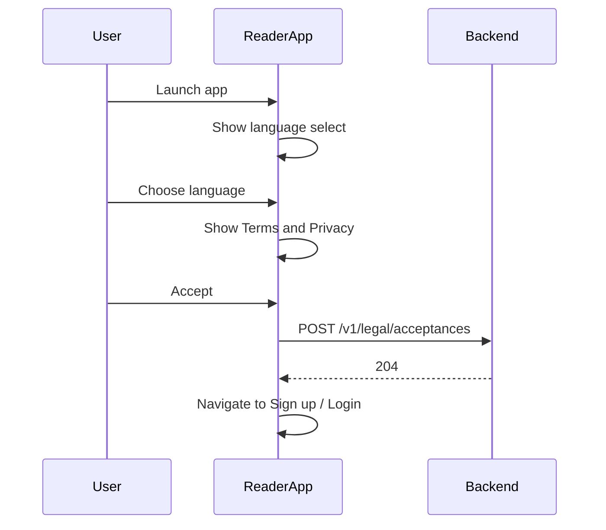
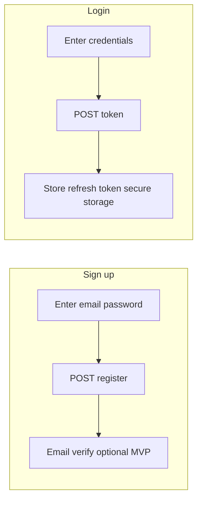
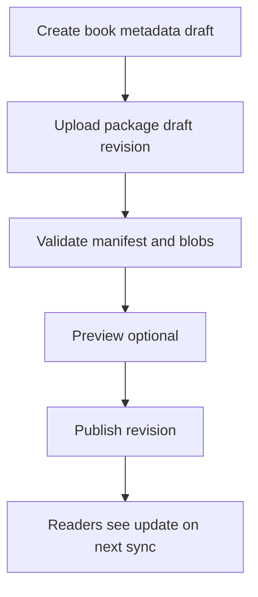
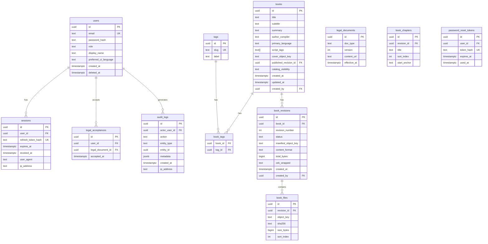

# Ethiopian Religious Books Platform — Requirements & Data Model

**Document version:** 1.0  
**Status:** MVP (v1) baseline — aligned with product plan §1.1  
**Components:** Reader mobile app · Web admin · Backend API · Object storage  

**Related documentation:** [Local setup & dev ergonomics (Docker, scripts, pre-commit)](SETUP.md) · [UI/UX requirements — reader & admin experience](README-UI-UX.md) · [Implementation plan — pages, APIs, technical decisions, Docker Compose local stack](README-IMPLEMENTATION.md)

This README is the **authoritative requirements and flow specification** for the MVP. Post-MVP items are called out explicitly.

---

## 1. Purpose and scope

### 1.1 Product purpose

Deliver a curated library of **Ethiopian religious texts** where:

- **Publishers** ingest and publish books through a **web admin** console.
- **Readers** consume content **only inside** the mobile app, with **offline** support and **baseline digital protection** (no copy/export of book text; screenshot/recording deterrence on Android where the OS allows).

### 1.2 MVP boundary

| In MVP | Out of MVP (documented for later) |
|--------|-----------------------------------|
| Android-first reader (iOS v1 optional per policy) | MFA, device caps, license tiers, promo codes |
| Web admin + backend + object storage | In-app admin, watermarking, Play Integrity gating |
| Catalog, download, read offline, TOC, bookmarks, metadata search | Full-text search inside books, highlights, notes, audio, push, widgets |
| Email/password auth, password reset | Phone OTP, org SSO |
| Encrypted book payloads at rest; `FLAG_SECURE` on reader surfaces | Forensic watermarking, root/jailbreak block |

### 1.3 Honest security positioning (requirement)

**REQ-SEC-001:** All user-facing copy and legal text MUST state that protection targets **digital** capture (screenshots, clipboard, files) and **does not** prevent photography with another camera or shoulder surfing.

---

## 2. Definitions

| Term | Definition |
|------|------------|
| **Book** | A logical work (e.g. “Book of …”) with stable `book_id`. |
| **Revision** | An immutable content snapshot of a book (`revision_id`, monotonic version). Only one **published** revision per book is canonical for readers at a time (MVP: simple model). |
| **Package** | Encrypted blob(s) + manifest the app downloads and stores locally. |
| **Reader** | End user with `role = reader`. |
| **Admin** | Publisher user with `role = admin` (or finer roles later). |

---

## 3. Actors and permissions

### 3.1 Reader

- Register, log in, reset password, update minimal profile.
- List **published** books; view detail; **download** package; **read** offline.
- Manage **local** reading position and **local** bookmarks (MVP: stored on device; see §10.2).
- Search catalog by **title, author/compiler, tags** (server-backed).

### 3.2 Admin

- Log in to web admin.
- CRUD book **metadata**; upload **content package**; order **chapters**; set **published** / **unpublished**.
- Upload optional **cover image**.
- View **audit log** of administrative actions.

### 3.3 System

- Issues **access tokens** and **refresh tokens** for readers and admins.
- Stores **encrypted** book objects; never returns **decrypted** book body to admin browser in production unless using a dedicated preview pipeline (see §6.5).

---

## 4. Functional requirements (MVP)

### 4.1 Reader app — onboarding & legal

| ID | Requirement |
|----|-------------|
| REQ-R-001 | On first launch, user MUST select UI language from configured set (minimum **English**; recommend **Amharic** + English). |
| REQ-R-002 | User MUST accept **Terms of Use** and **Privacy Policy** (versioned); acceptance timestamp and version id MUST be recorded **on server** at first acceptance. |
| REQ-R-003 | App MUST show short acceptable-use summary: no redistribution, no circumvention. |
| REQ-R-004 | Until Terms accepted, reader MUST NOT access catalog or downloads. |

### 4.2 Reader app — account

| ID | Requirement |
|----|-------------|
| REQ-R-010 | Sign up with **email** + **password**; password policy: min length ≥ 10 (configurable), block common passwords (optional integration). |
| REQ-R-011 | Login returns session; support **logout** (invalidate refresh token server-side). |
| REQ-R-012 | **Password reset** via email link (time-limited token). |
| REQ-R-013 | Profile: `display_name`, `preferred_ui_language`; persist to server. |

### 4.3 Reader app — catalog & download

| ID | Requirement |
|----|-------------|
| REQ-R-020 | Home shows **Continue reading** (last opened book + position) and list of **published** books. |
| REQ-R-021 | Book detail: title, subtitle (optional), summary, author/compiler, language tags, script labels, **published revision** `updated_at`, approximate **download size**, download/delete-local actions. |
| REQ-R-022 | **Download** pulls manifest + encrypted payload(s); show progress; retry on failure; honor **Wi‑Fi only** user setting. |
| REQ-R-023 | **Delete local** removes decrypted cache (if any) and encrypted files for that book; must not delete server entitlement data (MVP: all authenticated readers see all published books). |
| REQ-R-024 | If **new revision** published while old package present, UI MUST show **“Update available”**; user can **Update** (re-download replaces local revision). |
| REQ-R-025 | Low storage: if free space below threshold before download, block download with clear message. |

### 4.4 Reader app — reading

| ID | Requirement |
|----|-------------|
| REQ-R-030 | Open book only if local package for **current published revision** exists (or stream-only mode — **out of MVP**; MVP is download-to-read). |
| REQ-R-031 | **TOC**: list chapters/sections from manifest; tap navigates. |
| REQ-R-032 | **Single layout mode for v1** (product pick): **continuous vertical scroll** *or* **paginated** — implement one consistently. |
| REQ-R-033 | Typography: font family with **Ethiopic** coverage; user-adjustable **font size**; **light/dark** theme. |
| REQ-R-034 | Persist **reading position** per `(user, book, revision)` locally; restore on reopen. |
| REQ-R-035 | **Bookmarks**: add/remove/list; optional **label**; stored **locally** (MVP). |
| REQ-R-036 | **No** text selection, **no** copy, **no** share sheet for book content. |
| REQ-R-037 | Android: apply **`FLAG_SECURE`** to activities/screens showing book content (and preview if any). |
| REQ-R-038 | Book content files MUST NOT be exposed via OS file picker or “Open with”. |

### 4.5 Reader app — search

| ID | Requirement |
|----|-------------|
| REQ-R-040 | Global search queries **title, author/compiler, tags** via API; results open book detail. |
| REQ-R-041 | **No** full-text inside book body in MVP unless explicitly added as stretch (requires indexing pipeline). |

### 4.6 Reader app — support & quality

| ID | Requirement |
|----|-------------|
| REQ-R-050 | In-app **FAQ**: offline use, downloads, screenshots on Android, account issues. |
| REQ-R-051 | **Contact support** (mailto or web form URL). |
| REQ-R-052 | Integrate **crash reporting**; no logging of book plaintext. |

### 4.7 Web admin

| ID | Requirement |
|----|-------------|
| REQ-A-001 | Admin authentication (same identity system as readers but **role admin**). |
| REQ-A-002 | Create/edit book: `title`, `subtitle`, `summary`, `author_compiler`, `primary_language`, `script_tags` (enum/multi), optional `cover_image`. |
| REQ-A-003 | Manage ordered **chapters** (id, title, sort_index) in admin UI; chapter boundaries MUST match manifest used by reader. |
| REQ-A-004 | Upload **content package** for a **draft revision**; validate structure (see §9). |
| REQ-A-005 | **Publish** sets revision to **published**; previous published revision archived (readers see update). |
| REQ-A-006 | **Unpublish** hides book from reader catalog (existing local copies: reader app SHOULD detect on next catalog sync and restrict opening — see REQ-R-060). |
| REQ-A-007 | **Preview** (v1): browser preview may use **sanitized HTML** upload **or** server-side render of draft; MUST NOT weaken encryption requirements for **production** packages. |
| REQ-A-008 | **Audit log** entry for: login, book create/update, revision upload, publish/unpublish, cover change. |

### 4.8 Backend & API

| ID | Requirement |
|----|-------------|
| REQ-B-001 | HTTPS only; TLS 1.2+. |
| REQ-B-002 | **JWT access token** (short) + **refresh token** (rotating, revocable). |
| REQ-B-003 | Reader endpoints: catalog list, book detail, search, **manifest URL**, **encrypted package URL(s)** (time-limited signed URLs recommended). |
| REQ-B-004 | Admin endpoints: book CRUD, revision upload, publish, audit query (paginated). |
| REQ-B-005 | Store book binaries in **object storage** (S3-compatible); DB holds metadata + pointers + checksums. |
| REQ-B-006 | Passwords hashed with **Argon2id** or **bcrypt** (single standard across codebase). |

### 4.9 Catalog sync when book unpublished (MVP behavior)

| ID | Requirement |
|----|-------------|
| REQ-R-060 | On catalog fetch, if a locally installed book is **no longer published**, app MUST **block opening** and show message; offer **delete local copy**. |

---

## 5. Non-functional requirements

| ID | Category | Requirement |
|----|----------|-------------|
| REQ-NF-001 | Performance | Catalog API p95 < 500 ms for typical payloads; signed URL generation < 200 ms. |
| REQ-NF-002 | Performance | Reader cold start to library < 3 s on mid-range Android (excluding network). |
| REQ-NF-003 | Security | No book plaintext at rest on server disk; packages encrypted; keys handled per §8. |
| REQ-NF-004 | Privacy | Minimal PII; document retention in Privacy Policy. |
| REQ-NF-005 | Availability | Target 99.5% API monthly (MVP). |
| REQ-NF-006 | Backup | DB daily backup; object storage versioning optional. |
| REQ-NF-007 | Compliance | GDPR-style delete/export: **account deletion** request workflow (MVP: soft-delete user + revoke tokens). |

---

## 6. Flows

### 6.1 Reader: first-time onboarding



**Steps**

1. User opens app → select UI language (persist locally + sync to profile when logged in).  
2. Display Terms + Privacy (linked full documents).  
3. User accepts → client sends `document_type`, `document_version`, `accepted_at`.  
4. Navigate to authentication.

### 6.2 Reader: registration and login



**Rules**

- After successful login, fetch **catalog** and merge with local state (continue reading, downloads).  
- Refresh token stored in **Android Keystore** / **EncryptedSharedPreferences** (or platform equivalent).

### 6.3 Reader: download and offline read

```mermaid
sequenceDiagram
  participant U as User
  participant App as ReaderApp
  participant API as Backend
  participant S3 as ObjectStorage

  U->>App: Tap Download
  App->>App: Check WiFi policy and free space
  App->>API: GET book detail + manifest URL
  API-->>App: manifest signed URL
  App->>S3: GET manifest.json
  App->>API: GET package part URLs
  App->>S3: GET encrypted blobs
  App->>App: Verify checksums; store encrypted
  U->>App: Open book
  App->>App: Decrypt in memory for rendering only
```

**Rules**

- Decrypted plaintext MUST reside only in **volatile memory** for rendering; do not write decrypted full text to disk.  
- Optional small **render cache** (e.g. images): if used, MUST be encrypted at rest (file-level or SQLCipher).

### 6.4 Reader: revision update

1. Catalog/detail includes `published_revision` + `content_version`.  
2. If local `revision_id` < server `published_revision_id`, show **Update available**.  
3. User confirms → delete old local encrypted package → download new manifest + blobs → verify.

### 6.5 Admin: create and publish book



**Steps**

1. Admin creates **book** row (`status = draft`).  
2. Admin creates **revision** row (`status = draft`), uploads encrypted package to staging path.  
3. Server validates **manifest schema**, file sizes, checksums, chapter ids.  
4. Admin clicks **Publish** → transaction: set revision `published`, set book `published_revision_id`, set previous published to `superseded`.  
5. Write **audit_log** entry.

### 6.6 Password reset

1. User requests reset → `POST /v1/auth/forgot-password` with email.  
2. Server always responds **200** (no email enumeration in message body); email sent if account exists.  
3. User opens link with `token` → sets new password → `POST /v1/auth/reset-password`.  
4. Invalidate all refresh tokens for user.

---

## 7. Content package and encryption (requirements)

### 7.1 Package layout (logical)

```
package.zip (or multi-part upload)
├── manifest.json          # plaintext or signed JSON (see below)
├── content.enc            # AES-GCM encrypted bulk (example)
├── assets/                # optional encrypted assets map in manifest
```

### 7.2 Manifest fields (minimum)

| Field | Type | Description |
|-------|------|-------------|
| `manifest_version` | int | Schema version. |
| `book_id` | uuid | Matches server. |
| `revision_id` | uuid | Matches server. |
| `content_format` | string | e.g. `html_chunks`, `epub_subset`, `custom_json`. |
| `chapters[]` | array | `id`, `title`, `sort_index`, `anchor` or `byte_range`. |
| `files[]` | array | `path`, `sha256`, `size_bytes`. |
| `encryption` | object | Algorithm, KDF params; **do not** embed content keys in manifest. |

### 7.3 Key distribution (MVP recommendation)

**REQ-ENC-001:** Content encryption key (CEK) is generated **server-side** per revision, wrapped with a **server KEK** in KMS; reader receives CEK only via **authenticated API** at download time, over TLS, then stores CEK in **device secure storage** tied to app install (not in backups).

**REQ-ENC-002:** CEK MUST NOT appear in admin preview responses in production logs.

*Alternative (simpler but weaker):* per-user encryption — larger key management surface; **defer** post-MVP unless required.

---

## 8. API outline (REST, versioned `/v1`)

### 8.1 Auth

- `POST /v1/auth/register`  
- `POST /v1/auth/login`  
- `POST /v1/auth/refresh`  
- `POST /v1/auth/logout`  
- `POST /v1/auth/forgot-password`  
- `POST /v1/auth/reset-password`  

### 8.2 Legal

- `POST /v1/legal/acceptances` (auth optional for first accept before full account — product choice; typically post-register only)

### 8.3 Reader catalog

- `GET /v1/books?query=&tag=`  
- `GET /v1/books/{book_id}`  
- `GET /v1/books/{book_id}/download` → returns `{ revision_id, manifest_url, keys, package_parts[] }`  

### 8.4 Admin

- `POST /v1/admin/books`  
- `PATCH /v1/admin/books/{id}`  
- `POST /v1/admin/books/{id}/revisions` (initiate upload)  
- `POST /v1/admin/books/{id}/revisions/{rev_id}/complete`  
- `POST /v1/admin/books/{id}/publish`  
- `POST /v1/admin/books/{id}/unpublish`  
- `GET /v1/admin/audit_logs?cursor=`  

*(Exact shapes belong in OpenAPI; this README states capability.)*

---

## 9. Validation rules (admin upload)

| Check | Action on failure |
|-------|-------------------|
| Manifest parses; required fields present | Reject upload |
| Every file `sha256` matches | Reject |
| Chapter ids unique; `sort_index` contiguous or gap-tolerant per policy | Reject or warn |
| Total size under configured max | Reject |
| MIME/types allowlist | Reject |

---

## 10. Database model

### 10.1 Server database (PostgreSQL)

**Conventions:** `uuid` PKs, `timestamptz`, soft delete where noted. All timestamps UTC.

#### Entity relationship (logical)



#### Table definitions (DDL-style reference)

**`users`**

| Column | Type | Constraints / notes |
|--------|------|---------------------|
| `id` | `uuid` | PK, default `gen_random_uuid()` |
| `email` | `citext` | UNIQUE, NOT NULL |
| `password_hash` | `text` | NOT NULL for local auth |
| `role` | `text` | `CHECK (role IN ('reader','admin'))` |
| `display_name` | `text` | |
| `preferred_ui_language` | `text` | e.g. `am`, `en` |
| `created_at` | `timestamptz` | NOT NULL, default `now()` |
| `updated_at` | `timestamptz` | |
| `deleted_at` | `timestamptz` | soft delete |

Indexes: `(email)` unique partial `WHERE deleted_at IS NULL`.

**`sessions`**

| Column | Type | Notes |
|--------|------|-------|
| `id` | `uuid` | PK |
| `user_id` | `uuid` | FK → `users(id)` |
| `refresh_token_hash` | `text` | hash of opaque token |
| `expires_at` | `timestamptz` | |
| `revoked_at` | `timestamptz` | |
| `user_agent` | `text` | |
| `ip_address` | `inet` | |

Indexes: `(user_id)`, partial unique on `refresh_token_hash` where not revoked.

**`legal_documents`**

| Column | Type | Notes |
|--------|------|-------|
| `id` | `uuid` | PK |
| `doc_type` | `text` | `terms`, `privacy` |
| `version` | `int` | monotonic per `doc_type` |
| `content_url` | `text` | or inline `content_markdown` |
| `effective_at` | `timestamptz` | |

**`legal_acceptances`**

| Column | Type | Notes |
|--------|------|-------|
| `id` | `uuid` | PK |
| `user_id` | `uuid` | FK |
| `legal_document_id` | `uuid` | FK |
| `accepted_at` | `timestamptz` | NOT NULL |

Unique `(user_id, legal_document_id)`.

**`books`**

| Column | Type | Notes |
|--------|------|-------|
| `id` | `uuid` | PK |
| `title` | `text` | NOT NULL |
| `subtitle` | `text` | |
| `summary` | `text` | |
| `author_compiler` | `text` | |
| `primary_language` | `text` | ISO 639-1 or BCP-47 |
| `script_tags` | `text[]` | e.g. `Ethi`, `Latn` |
| `cover_object_key` | `text` | nullable |
| `published_revision_id` | `uuid` | FK → `book_revisions(id)`, nullable |
| `catalog_visibility` | `text` | `published`, `hidden` |
| `created_by` | `uuid` | FK → `users` |
| `created_at` | `timestamptz` | |
| `updated_at` | `timestamptz` | |

Indexes: GIN on `to_tsvector` for title/author if using Postgres full-text on metadata; `(catalog_visibility)`.

**`book_revisions`**

| Column | Type | Notes |
|--------|------|-------|
| `id` | `uuid` | PK |
| `book_id` | `uuid` | FK → `books` |
| `revision_number` | `int` | auto-increment per book |
| `status` | `text` | `draft`, `published`, `superseded`, `archived` |
| `manifest_object_key` | `text` | |
| `content_format` | `text` | |
| `total_bytes` | `bigint` | |
| `cek_wrapped` | `bytea` | KMS-wrapped CEK for this revision |
| `created_by` | `uuid` | |
| `created_at` | `timestamptz` | |

Unique `(book_id, revision_number)`.

**`book_files`**

| Column | Type | Notes |
|--------|------|-------|
| `id` | `uuid` | PK |
| `revision_id` | `uuid` | FK |
| `object_key` | `text` | |
| `sha256` | `text` | hex |
| `size_bytes` | `bigint` | |
| `part_index` | `int` | for ordering multi-part |

**`book_chapters`** (optional denormalization from manifest for SQL search later)

| Column | Type | Notes |
|--------|------|-------|
| `id` | `uuid` | PK |
| `revision_id` | `uuid` | FK |
| `chapter_key` | `text` | stable id from manifest |
| `title` | `text` | |
| `sort_index` | `int` | NOT NULL |

**`tags`**, **`book_tags`** — as in diagram.

**`password_reset_tokens`**

| Column | Type | Notes |
|--------|------|-------|
| `id` | `uuid` | PK |
| `user_id` | `uuid` | FK |
| `token_hash` | `text` | UNIQUE |
| `expires_at` | `timestamptz` | |
| `used_at` | `timestamptz` | |

**`audit_logs`**

| Column | Type | Notes |
|--------|------|-------|
| `id` | `uuid` | PK |
| `actor_user_id` | `uuid` | FK |
| `action` | `text` | e.g. `book.publish` |
| `entity_type` | `text` | |
| `entity_id` | `uuid` | |
| `metadata` | `jsonb` | |
| `created_at` | `timestamptz` | |
| `ip_address` | `inet` | |

Index: `(created_at DESC)`, `(actor_user_id, created_at DESC)`.

---

### 10.2 Reader local database (on-device)

Use **SQLCipher** or platform **encrypted** store. MVP tables:

**`local_books`**

| Column | Type | Notes |
|--------|------|-------|
| `book_id` | `text` | PK |
| `revision_id` | `text` | |
| `title` | `text` | cached from server |
| `encrypted_package_path` | `text` | |
| `manifest_path` | `text` | |
| `downloaded_at` | `int` | epoch |
| `bytes_on_disk` | `int` | |

**`reading_progress`**

| Column | Type | Notes |
|--------|------|-------|
| `book_id` | `text` | PK |
| `revision_id` | `text` | part of PK |
| `chapter_id` | `text` | |
| `offset` | `real` or `int` | format-specific |
| `updated_at` | `int` | |

**`bookmarks`**

| Column | Type | Notes |
|--------|------|-------|
| `id` | `text` | PK uuid |
| `book_id` | `text` | |
| `revision_id` | `text` | |
| `chapter_id` | `text` | |
| `offset` | `int` | |
| `label` | `text` | nullable |
| `created_at` | `int` | |

**`settings`**

| Column | Type | Notes |
|--------|------|-------|
| `key` | `text` | PK |
| `value` | `text` | JSON string |

Keys: `ui_language`, `wifi_only_downloads`, `theme`, `font_scale`.

**`content_keys`** (if CEK cached)

| Column | Type | Notes |
|--------|------|-------|
| `revision_id` | `text` | PK |
| `wrapped_cek` | `blob` | or reference to Keystore alias |

---

## 11. Error codes (reader-facing)

| Code | HTTP | Meaning |
|------|------|---------|
| `AUTH_INVALID` | 401 | Re-login |
| `FORBIDDEN` | 403 | Role mismatch |
| `BOOK_NOT_PUBLISHED` | 404 | Hidden or removed |
| `REVISION_GONE` | 410 | Old revision invalid; update |
| `STORAGE_FULL` | 507 | Client-side before download |
| `RATE_LIMIT` | 429 | Backoff |

---

## 12. Open decisions (to lock before implementation)

1. **iOS in v1:** yes/no (screenshot posture).  
2. **Scroll vs paginated** reading for MVP.  
3. **Email verification** on sign-up: required or optional.  
4. **Content format** inside package: HTML chunks vs custom JSON vs EPUB subset.  
5. **Preview pipeline** for admin: static HTML upload vs server renderer.

---

## 13. Traceability

This document implements the **MVP (§1.1)** described in the internal product plan *Ethiopian religious books app — product and technical proposal*. Post-MVP features should extend §7 of that plan without changing MVP REQ ids without versioning this README.
